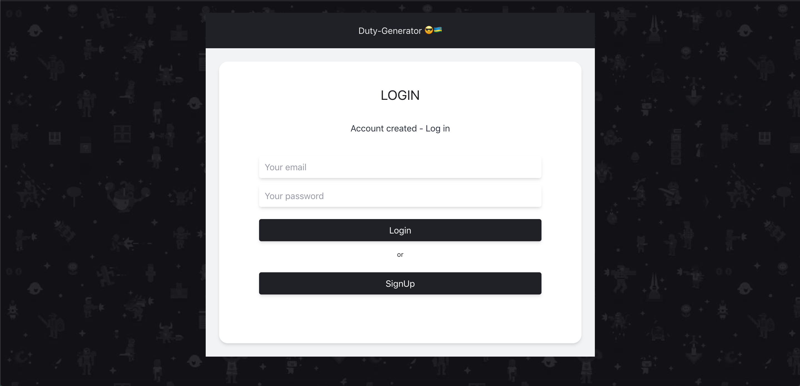

# DutyGenerator-FrontEnd 😎🇷🇼 (Task-Force-Challenge)

The user interface for DutyGenerator app



# link to the API (Backend)

`https://github.com/pextech/Front-end-dutygenerator.git`


# Installation and Environment Setup

**Clone the repository from [Github](https://github.com/pextech/Front-end-dutygenerator.git).**

( You will need **Git** for this if you are running a Windows PC, Get it [HERE](https://git-scm.com/) )

```
git clone https://github.com/pextech/Front-end-dutygenerator.git
```

**To Install all dependencies:**

```
npm install
```

**CD in the Client folder:**

```
cd client
```

**Now to start the app:**

```
npm run start
```


# Tools used

- React **javascript UI library**
- Tailwind: **css**
- Redux: **State manager**

# More Tools

- ES6 Transpiler: **[Babel](babeljs.io)**
<!-- - Deployment: **[Heroku](https://www.heroku.com)** and **[Netlify](https://www.netlify.com/)** -->

- Deployment : **Github-Pages**

# Author 

` Pextech 😎🇷🇼 `

